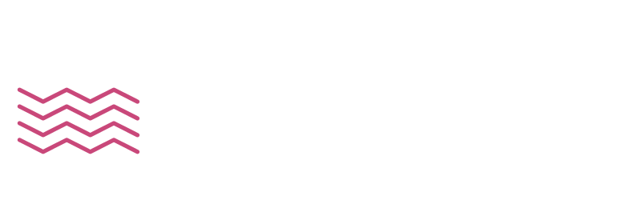

# PLAYA

[](https://gitlab.com/ricardomatias/playa/commits/master)
[](https://gitlab.com/ricardomatias/playa/commits/master)



PLAYA *(pronounced `ˈpleɪə`)* is a musical theory framework aimed at creating musical phrases. It has concepts such as Keys, Scales, Chords and Notes, with which it provides ways of generating musical phrases.

## Install

```bash
npm install --save playa
```

## Usage

```js
import { Core, Tools, Functional, Constants } from 'playa';

// or everything
import * as Playa from 'playa';
```

## Example

```js

```

## Documentation

## License

[Open Software License 3.0](LICENSE)
